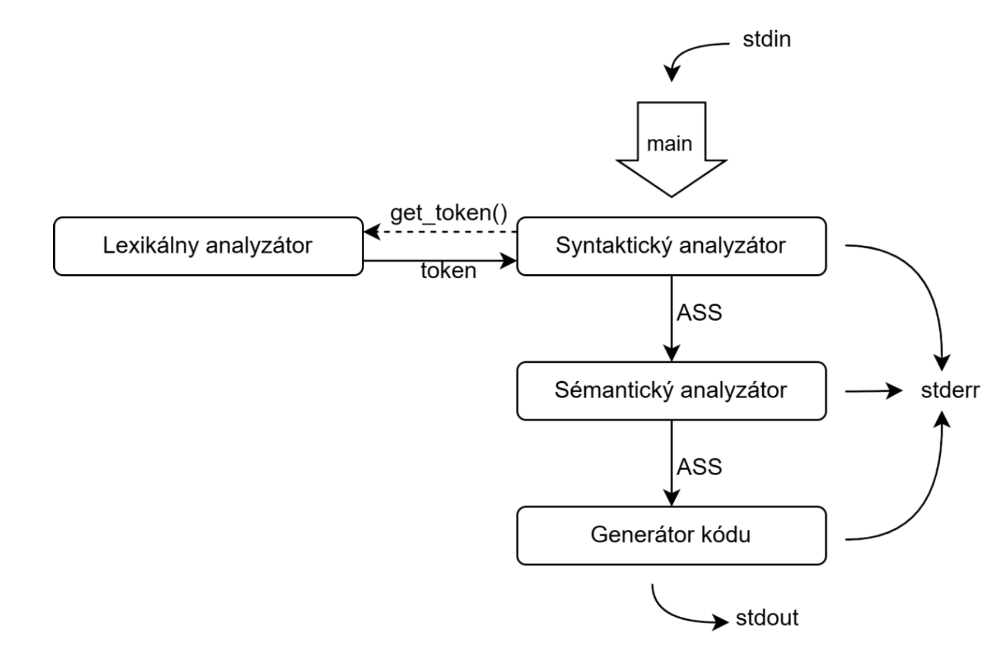
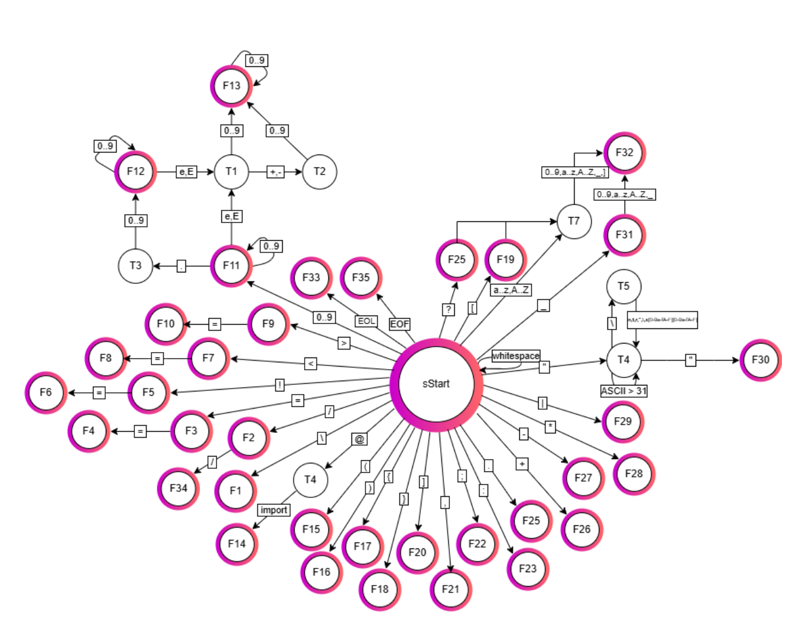
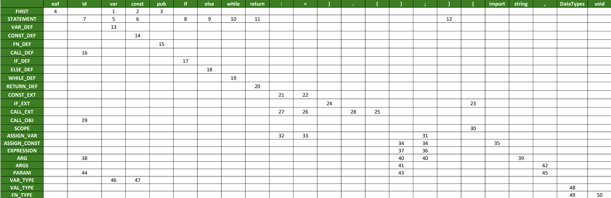
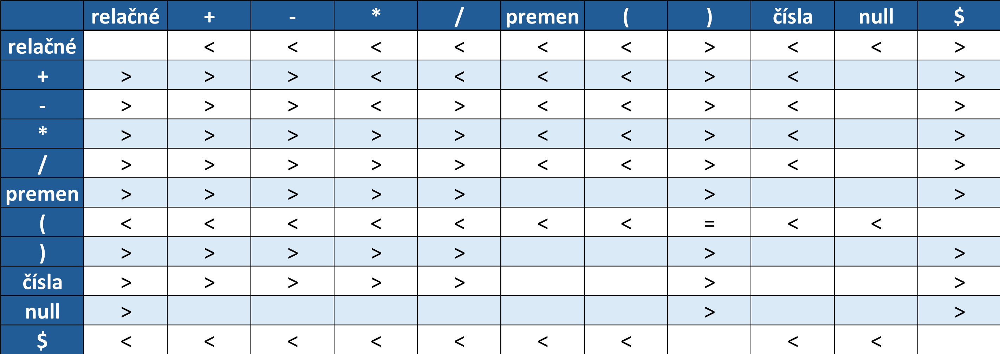

# Implementation of an Imperative Language Compiler IFJ24

> Project for the subjects Formalni Jazyky (IFJ) and Algoritmy (IAL)

## Table of Contents

*   [1 Introduction](#1-introduction)
*   [2 Design and Implementation](#2-design-and-implementation)
    *   [Compiler structure](#compiler-structure)
    *   [2.1 Lexical Analysis](#21-lexical-analysis)
        *   [FSM for lexical analysis](#fsm-for-lexical-analysis)
    *   [2.2 Syntactic Analysis](#22-syntactic-analysis)
        *   [2.2.1 Top-Down SA](#221-top-down-sa)
            *   [LL - table](#ll---table)
        *   [2.2.2 Bottom-Up SA](#222-bottom-up-sa)
            *   [Table of precedence](#table-of-precedence)
    *   [2.3 Semantic Analysis](#23-semantic-analysis)
    *   [2.4 Code Generator](#24-code-generator)
    *   [2.5 Makefile](#25-makefile)
*   [3 Team Work](#3-team-work)
    *   [3.1 Version Control System](#31-version-control-system)
    *   [3.2 Communication](#32-communication)
    *   [3.3 Task Distribution](#33-task-distribution)
*   [Requirements](#requirements)
*   [Build](#build)
*   [Testing](#testing)
*   [Cloning](#cloning)
    *   [All including submodules](#all-including-submodules)
    *   [Update existing submodules](#update-existing-submodules)
*   [Authors](#authors)
    *   [Team: Team xbockaa00](#team-team-xbockaa00)
*   [Example of compiler usage (for testing)](#example-of-compiler-usage-for-testing)
*   [Running Tests: "IFJ24-tests"](#running-tests-ifj24-tests)
*   [LL - grammar](#ll---grammar)

## 1 Introduction

The goal of the project is to create a program in C that reads source code written in the IFJ24 language and translates it into the target language IFJcode24. If the translation completes without errors, the program will return an exit code of 0. If an error occurs, the program will return a non-zero exit code specified in the assignment.

The compiler functions as a console application that reads the source program from standard input and generates the resulting intermediate code to standard output. All error messages, warnings, or debugging output are generated to standard error output.

## 2 Design and Implementation

The implementation of the project consisted of the mutual cooperation of partial parts of the program described in this chapter.

### Compiler structure 


### 2.1 Lexical Analysis

In the implementation of the compiler, the basis is lexical analysis, which is implemented in the function `get_token`. This function sequentially reads characters from the input and generates tokens based on them. The entire process is controlled by a deterministic finite automaton (FSM) that determines what type of token will be generated – whether it is an identifier, a keyword, a numerical value, or other characters defined in the IFJ2024 language.

Tokens are represented by a `Token` structure, which contains three main components:

1.  Token type (`Token_type`), which specifies the category of the token (e.g., identifier, left parenthesis, semicolon, etc.).
2.  Token value (`Token_Value`), which represents the actual value in the string, for example, a number.
3.  Keyword type (`Keyword`), which indicates if the token is a keyword, and if so, its specific value.

Tokens are used in further analysis phases, where they are processed according to the syntactic rules of the language. The lexical analyzer is based on a deterministic finite automaton that transitions between states depending on the characters read. The `get_token` function uses an infinite loop (`switch-case`) which switches between different automaton states based on the sequence of characters read. If a character is encountered during processing that can be immediately processed, the corresponding token is returned without changing the automaton's state.

If an error occurs (e.g., an invalid sequence of characters), the function automatically calls `handle_error(ERR_LEX)`, which signals an error in lexical analysis and terminates the program with an exit code of 1.

### FSM for lexical analysis

---

### 2.2 Syntactic Analysis

The controlling part of the entire program is the syntactic analysis, which is implemented using a mixed approach: top-down and bottom-up.

#### 2.2.1 Top-Down SA

The construction of the top-down syntactic analysis is based on an LL-grammar, which uses a recursive descent method according to the rules in the LL-table. All non-terminals defined in the LL-grammar have their own function.

Syntactic analysis works by requesting a processed token from the lexical analysis using the function `get_token(file)`.

#### LL - table


#### 2.2.2 Bottom-Up SA

The construction of the bottom-up syntactic analysis is based on precedence syntactic analysis. Its implementation is located in the top-down syntactic analysis section. It is called as the function `EXPRESSION(file, token)`.

The algorithm function involves filling two stacks. The first stack, `precStack`, is intended for storing relational operators, terminals, and non-terminals which are pushed/popped from the stack according to the precedence table. We select the column and row based on the topmost terminal in the `precStack` and the terminal that is the algorithm's input. The second stack, `ruleStack`, is filled with terminals only in case of a reduction from the `precStack` according to the determined rule. In this stack, we get an ordering of terminals from which we can easily create an abstract syntax sub-tree for each expression.

#### Table of precedence


### 2.3 Semantic Analysis

Semantic analysis checks the correctness of the program code, especially regarding data types, variable declarations, expressions, and scopes. This process follows syntactic analysis, which populates the abstract syntax tree (`AST`). After the tree is built, semantic analysis performs various checks, utilizing a symbol table that stores information about declared variables (type, value, constant status), functions, and other symbols.

*   **Type Checking:** Verifies whether expressions are compatible according to their types (e.g., during value assignment, arithmetic operations, or function calls with incorrect parameters). Ensures that operators use compatible types.
*   **Declaration Checking:** Verifies that all variables are correctly declared and that their types correspond to their usage in the program.
*   **Scope Checking:** For each variable, it determines whether it is used in the correct scope, whether local or global. The symbol table stores information about variable scopes, which allows for correct access verification.
*   **Function Handling:** Checks function definitions (name, parameter types, return type) and verifies type compatibility of parameters and return types with the types used in the program call.

Additionally, it checks loops, conditions, and other code constructs, with the symbol table being continuously used to verify the correctness of these operations.

---

If an error occurs during analysis (e.g., an undefined variable), the program invokes an error using the `handle_error()` function, which stops execution and returns a predefined error code (e.g., `ERR_UNDEFINED_ID`). This process is executed in the main function `ProcessTree()`, which calls the appropriate functions based on the code being processed (e.g., conditions, expressions), which then call each other. This way, semantic analysis reaches the end of the program.

### 2.4 Code Generator

The code generator translates the source code in the IFJ24 language into the intermediate code `IFJcode24`. It works with the abstract syntax tree (`AST`), which is created during syntactic and semantic analysis, and generates the corresponding instructions for program execution.

**Implementation**

The implementation of the generator includes several main parts:

*   **Variable Declarations:**
    The functions `generateGlobalVarDecl` and `generateLocalVarDecl` generate instructions for declaring global and local variables, and possibly their initialization and value assignment.
*   **Constant Declarations:**
    The functions `generateGlobalConstDecl` and `generateLocalConstDecl` ensure the correct generation of constants, which are immutable during program execution.
*   **Control Structures:**
    For conditional statements and loops, functions like `generateIfStatement` and `generateWhileStatement` are used, which generate labels (`LABEL`) and jumps (`JUMP`) to control program flow.
*   **Built-in Functions:**
    The function `generateBuildInFuncions` generates code for built-in functions of the IFJ24 language, such as `write`, `readi32`, etc. These functions are often used for data manipulation.
*   **Function Generation:**
    The functions `generateFunctionParams` and `generateFunctionEnd` ensure the generation of function structures, including their parameters, as well as frame-related operations. Function calls are implemented using the `generateFunctionCall` function.

### 2.5 Makefile

An essential part of the project was the implementation of the `Makefile`, where rules for compilation, such as using the `gcc` compiler and all necessary parameters, are defined. The first thing that needed to be added was linking, where compiled objects are combined into a single executable file.

---

Besides compilation, we also used the `makefile` for automatic project packaging for submission and cleaning up temporary or compiled objects.

## 3 Team Work

For effective teamwork, we had to agree on communication rules, the version control system, and especially task distribution at the first meetings.

### 3.1 Version Control System

For project file management, we chose the **Git** version control system, along with using a remote repository on the **GitHub** platform.

### 3.2 Communication

The majority of communication among team members was handled by the **Discord** application. In-person meetings at school were held at two-week intervals.

### 3.3 Task Distribution

Initially, we tried to distribute the project work evenly, but over time, some team members showed less activity. To track progress and define individual tasks, we chose to use the **Linear** application, which helped us more accurately determine the final evaluation based on the work done.

## Requirements

To build the project, you need:

*   A standard C compiler (e.g., GCC). The project is designed to compile correctly on the FIT VUT `merlin` server using `gcc`.
*   `make` utility.

## Build

Navigate to the project root directory in your terminal. To build the compiler executable, run the `make` command:
```
make
```

## Testing
To run the generated intermediate code, use the `ic24int` interpreter:
```
ic24int vystupny_kod.ifjcode24
```
Combination of input and output:
```
ic24int vystupny_kod.ifjcode24 < vstupne_data.txt > vystup_programu.txt
```
For help:
```
ic24int --help
```

| Code | Description                                                      |
| ---- | ---------------------------------------------------------------- |
| 0    | Successful compilation                                           |
| 1    | Lexical error                                                    |
| 2    | Syntax error                                                     |
| 3    | Semantic error – undefined function/variable                     |
| 4    | Semantic error – wrong parameter type/count, discarded return value |
| 5    | Semantic error – redefinition, const assignment                  |
| 6    | Semantic error – `return` without/with excessive expression      |
| 7    | Semantic error – type incompatibility                            |
| 8    | Semantic error – undeducible type                                |
| 9    | Semantic error – unused/modifiable variable                      |
| 10   | Other semantic errors                                            |
| 99   | Internal compiler error                                          |


## Cloning
### All including submodules
To clone the main repository and its submodules, navigate to the directory where you want the project folder to be created and run:
```
git clone --recurse-submodules https://github.com/BockajAndrej/IFJ-project01
cd tests
git clone --recurse-submodules https://github.com/jansko03/IFJ24-tests
git clone https://github.com/ThrowTheSwitch/Unity.git
```
### Update existing submodules
If you have already cloned the main repository but not the submodules, navigate to the main repository's root directory (`IFJ-project01/`) and run:
```
git submodule update --init --recursive
```
> Unity test framework

## Authors

### Team: Team xbockaa00

| Team Member Name | Task Distribution | level of task completion |
| :--------------- | :---- | :---- |
| Andrej Bočkaj    | Team lead, Top-Down SA, Bottom-Up SA, Abstract Syntax Tree Generation, Readme, Documentation | 92% |
| Jakub Filo       | Lexical analysis, Semantic analysis, Symbol table, Dynamic string | 89% |
| Pavel Glvač      | Code generator, Doxygen, Abstract syntax tree | 2% |
| Jan Kubíček      | Unity tests | - |

### Example of compiler usage (for testing)
./ic24int ../src/main < ./prog/00.zig > ./output/OUTPUT.out 

## Running Tests: "IFJ24-tests"
./IFJ24-tests/test.sh ./IFJ24-tests/ ../src/main ic24int

## LL - grammar
1.  `FIRST` ::= `VAR_DEF FIRST`
2.  `FIRST` ::= `CONST_DEF FIRST`
3.  `FIRST` ::= `FN_DEF FIRST`
4.  `FIRST` ::= `t_EOF`
5.  `STATEMENT` ::= `VAR_DEF STATEMENT`
6.  `STATEMENT` ::= `CONST_DEF STATEMENT`
7.  `STATEMENT` ::= `CALL_DEF STATEMENT`
8.  `STATEMENT` ::= `IF_DEF STATEMENT`
9.  `STATEMENT` ::= `ELSE_DEF STATEMENT`
10. `STATEMENT` ::= `WHILE_DEF STATEMENT`
11. `STATEMENT` ::= `RETURN_DEF STATEMENT`
12. `STATEMENT` ::= `t_}`
13. `VAR_DEF` ::= `t_var t_id ASSIGN_VAR`
14. `CONST_DEF` ::= `t_const t_id CONST_EXT`
15. `FN_DEF` ::= `t_pub t_fn t_id t_( PARAM t_) SCOPE`
16. `CALL_DEF` ::= `t_id CALL_EXT`
17. `IF_DEF` ::= `t_if t_( EXPRESSION t_) IF_EXT`
18. `ELSE_DEF` ::= `t_else SCOPE`
19. `WHILE_DEF` ::= `t_while t_( EXPRESSION t_) SCOPE`
20. `RETURN_DEF` ::= `t_ret EXPRESSION`
21. `CONST_EXT` ::= `t_: VAL_TYPE t_= EXPRESSION`
22. `CONST_EXT` ::= `t_= ASSIGN_CONST`
23. `IF_EXT` ::= `SCOPE`
24. `IF_EXT` ::= `t_| t_id t_| SCOPE`
25. `CALL_EXT` ::= `t_( ARG t_)`
26. `CALL_EXT` ::= `t_= EXPRESSION`
27. `CALL_EXT` ::= `t_: VAL_TYPE t_= EXPRESSION`
28. `CALL_EXT` ::= `t_. CALL_OBJ`
29. `CALL_OBJ` ::= `t_id t_( ARG t_) t_;`
30. `SCOPE` ::= `t_{ STATEMENT`
31. `ASSIGN_VAR` ::= `t_;`
32. `ASSIGN_VAR` ::= `t_: VAL_TYPE t_= EXPRESSION t_;`
33. `ASSIGN_VAR` ::= `t_= EXPRESSION t_;`
34. `ASSIGN_CONST` ::= `EXPRESSION`
35. `ASSIGN_CONST` ::= `t_import t_( string t_) t_;`
36. `EXPRESSION` ::= `t_;`
37. `EXPRESSION` ::= `t_)`
38. `ARG` ::= `t_id ARGS`
39. `ARG` ::= `string ARGS`
40. `ARG` ::= `EXPRESSION ARGS`
41. `ARGS` ::= `t_)`
42. `ARGS` ::= `t_, ARG`
43. `PARAM` ::= `t_)`
44. `PARAM` ::= `t_id t_: VAL_TYPE PARAM`
45. `PARAM` ::= `t_, t_id t_: VAL_TYPE PARAM`
46. `VAR_TYPE` ::= `t_var`
47. `VAR_TYPE` ::= `t_const`
48. `VAL_TYPE` ::= `DataTypes`
49. `FN_TYPE` ::= `VAL_TYPE`
50. `FN_TYPE` ::= `t_void`
---